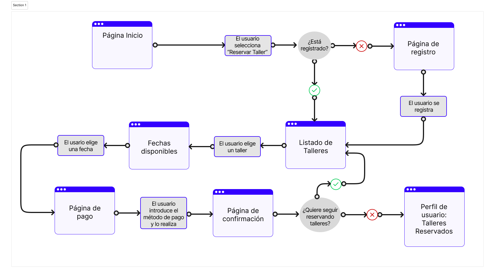
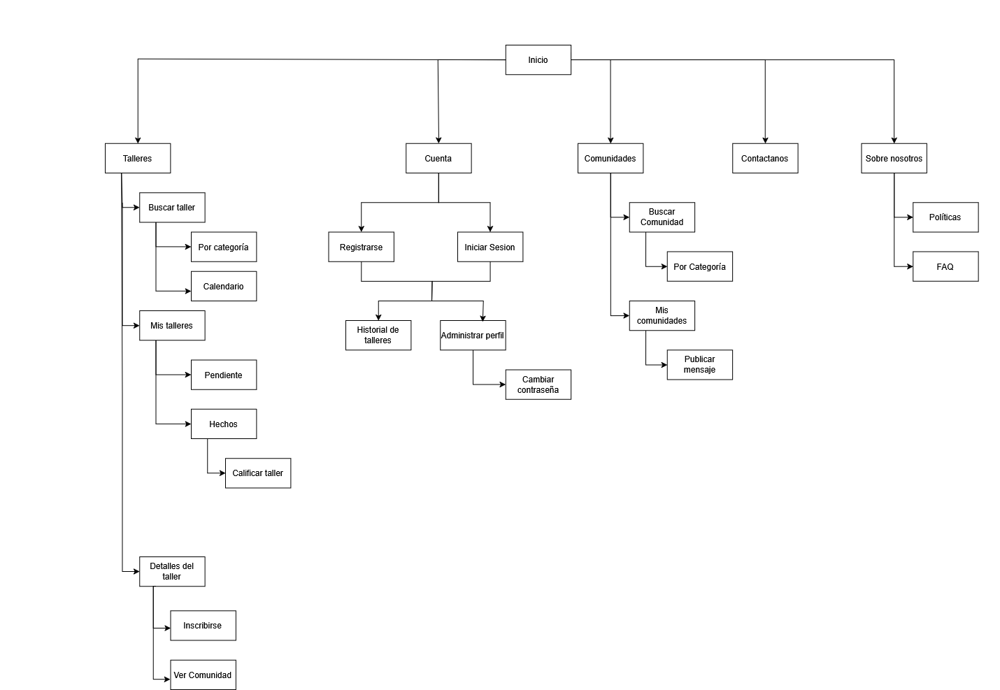
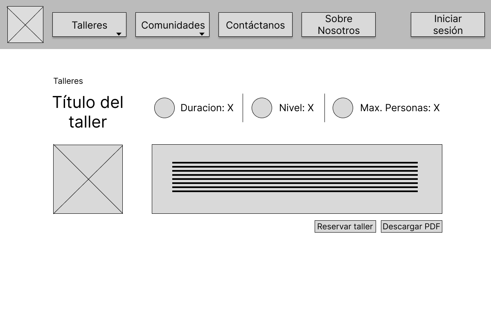
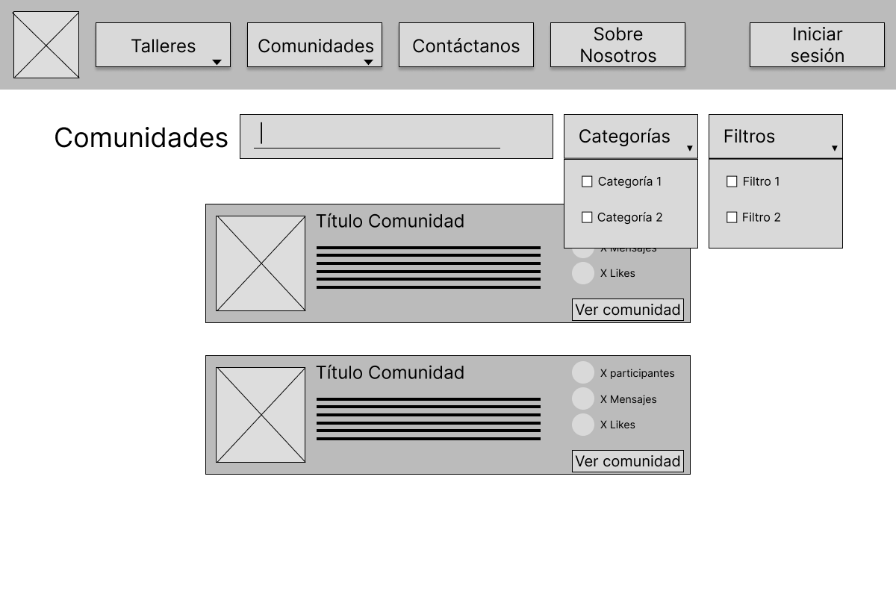

## DIU - Practica2, entregables

### Ideación 

* Mapa de empatía

[PDF para poder verlo mejor](Mapa%20de%20Empatía.pdf)

### PROPUESTA DE VALOR
* ScopeCanvas

[PDF para poder verlo mejor](Scope%20de%Canvas.pdf)

### TASK ANALYSIS

* User Task Matrix 
* User/Task flow

[PDF para poder verlo mejor](User%20Flow%20Map.pdf)

### ARQUITECTURA DE INFORMACIÓN

* Sitemap

[PDF para poder verlo mejor](SiteMap.pdf)

* [Labelling](Labelling.pdf)

### Prototipo Lo-FI Wireframe 

* Bocetos

* Wireframes
En el menú principal se debería mostrar algún curso destacado del mes, con la opción directa de poder reservarlo.
Añadir además una desccripción sobre qué son las comunidades y qué ventajas aportan al usuario.

### Conclusiones  
Durante esta práctica hemos podido profundizar en el enfoque del Diseño Centrado en el Usuario, aplicando herramientas que nos han ayudado a entender mejor las necesidades reales de las personas frente a un producto digital. A partir de los aprendizajes de la práctica anterior, hemos replanteado nuestra propuesta de valor con una nueva visión orientada al comercio y la sostenibilidad, un enfoque que nos ha parecido especialmente interesante por su relevancia actual.

Utilizando herramientas como el Empathy Map, el Feedback Capture Grid y el Scope Canvas, hemos podido estructurar mejor tanto las ideas como la organización del contenido, priorizando las tareas del usuario y visualizando el flujo de navegación de forma más clara. La elaboración del prototipo en papel y posteriormente en Figma (con diseño responsive) nos ha permitido trabajar de forma progresiva y comprobar cómo se podría ver y comportar el producto final en distintos dispositivos.

Consideramos que esta práctica ha sido muy útil para entender cómo se puede pasar de una necesidad detectada a una solución concreta y funcional, teniendo siempre presente al usuario final en cada paso. También valoramos positivamente el uso de herramientas colaborativas y visuales como FIGMA, que facilitan mucho el trabajo de diseño, sobre todo en fases iniciales.
