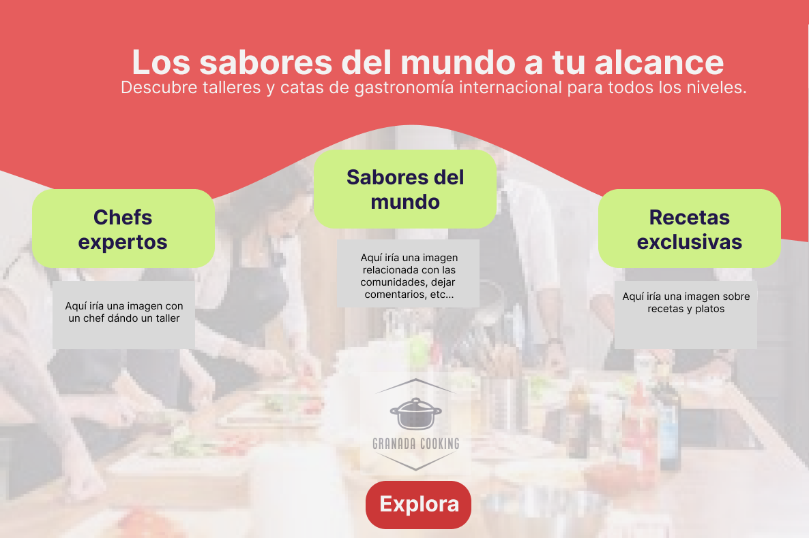
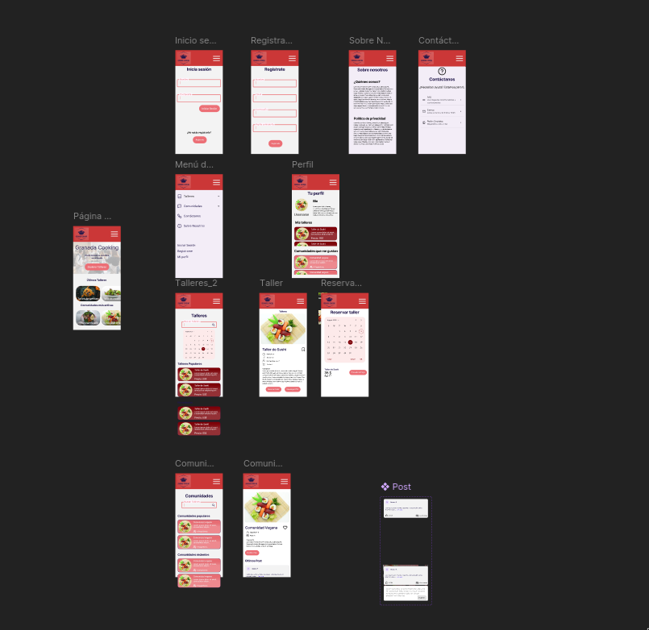

# DIU - Practica 3, entregables

## Moodboard (diseño visual + logotipo)   

Se ha realizado un Moodboard para establecer los estilos de nuesta aplicación. La paleta busca reflejar un ambiente amigable, para todo el público usando colores no tan saturados, y más pastel.

Como tipografías hemos elegido Calc Sans como principal y Quicksand como secundaria buscando un estilo que sea agradable y destacable al mismo tiempo para la principal y simple para la secundaria. El eslogan destaca que no solo ofrecemos una experiencia culinaria en Granada si no que proviene de todas las partes del mundo.

## Landing Page

La landing page representa el primer punto de contacto entre el usuario y nuestra aplicación, por lo que su diseño juega un papel fundamental en la captación de usuarios. Su objetivo principal es presentar de forma clara, atractiva y convincente el valor que ofrece la plataforma.

## Guidelines

### 1. Navegación & Estructura
- **Navbar** Permite una navegación clara y accesible
- **Hero Image + Carrusel**  Imagen destacada de un taller + carrusel con talleres recomendados, categorías o chefs.
- **Search (Búsqueda)**  Barra de búsqueda fija para filtrar talleres por nombre, tipo, ingredientes, etc.
- **Article List 5-7 Cards Items** Muestra las recetas más recientes y relevantes en un formato visual de tarjetas para facilitar su exploración.
### 2. Flujo de Usuario

- **Wizards (Flujo de Registro)**  Durante el proceso de registro, los usuarios son guiados.
- **Item Details + Actions (Detalles de Receta o Taller)**  En la vista de detalle, los usuarios pueden consultar información específica sobre un taller o comunidad y realizar acciones como **unirse**, **descargar PDF** o **reservar**.

- **Reserva de Talleres**   Proceso simplificado para seleccionar un taller y confirmar asistencia. Permite realizar reservas en pocos pasos.

- **Calendario de Eventos** Herramienta visual para explorar la disponibilidad de los talleres. Los usuarios pueden elegir una franja de tiempo y ver qué talleres hay disponibles.

- **Comunidades de Usuarios** Secciones dedicadas a distintas temáticas (por ejemplo, repostería, cocina vegana, principiantes). Los usuarios pueden unirse a comunidades para recibir sugerencias personalizadas o participar en eventos temáticos.

### 3. Comunicación y Retroalimentación

- **Form Input (Formulario de Contacto o Registro)**  Formularios intuitivos para facilitar el registro e inscripción a talleres/comunidades. Se evitan formularios extensos y se prioriza la experiencia de usuario.

- **About (Acerca de Nosotros)**  Página informativa sobre el equipo, misión y visión de la plataforma. Refuerza la **confianza y transparencia**, mostrando el valor humano detrás de los talleres ofrecidos.

## Mockup: LAYOUT HI-FI 

Para el Layout Hi-Fi hemos seguido diferentes guidelines sobre como realizar los scrolls laterales, horizontales, formularios de inicio de sesión, tarjetas, Help Pages, etc... Hemos buscado mantener la paleta lo máximo posible para que el diseño de la página sea consistente en su totalidad, así como añadido varios settings para poder navegar el hi-fi y así poder tener una idea de como será la experiencia del usuario.

En este [link](https://www.figma.com/design/4K1tR8tdYivjwLtCuL0Ex5/Layout-HI-FI?node-id=0-1&p=f&t=1mXaAcP23nyf6x6Z-0) se puede ver el Prototype en acción.
## Publicación del Case Study 

En el Case Study se presenta una visión detallada del desarrollo y diseño de nuestra aplicación, explicada de forma accesible para que cualquier persona, incluso sin conocimientos técnicos, pueda comprender el proceso y los objetivos del proyecto.

A continuación, puede visualizar el [Case Study](../README.md) que hemos llevado a cabo.

