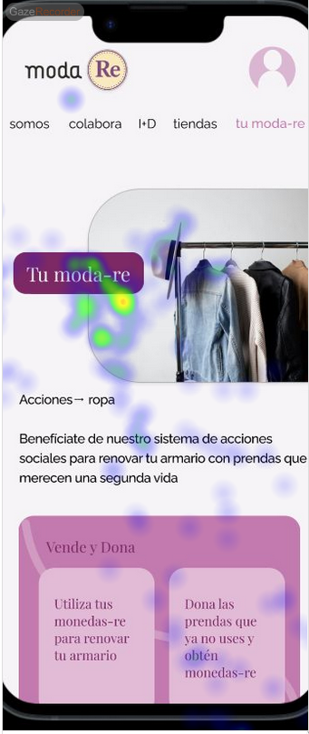
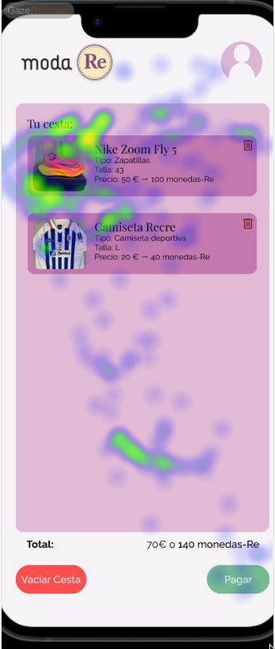

# Usability Report

#### Evaluación de usabilidad del proyecto 

### (Monedas-Re )

### (01/06/2025)

[Enlace a GITHUB del proyecto](https://github.com/McQueen-Sally/UX_CaseStudy)

[img Proyecto]

### Realizado por:

 * :bust_in_silhouette: [ Jose Vera Castillo ](https://github.com/VeraJose05)    :octocat:     
 * :bust_in_silhouette: [ David Pérez Tobarra](https://github.com/ParadoxalGlitch)     :octocat:

## 1 DESCRIPCIÓN DEL WEBSITE

[Incluir un breve resumen el propósito de la App]

El objetivo es fomentar y hacer más accesible la donación y la adquisición de prendas de segunda mano, ofreciendo un espacio específico dentro de la página de moda-re destinado a la compra y venta de ropa usada. Este punto de intercambio permitirá a los usuarios contribuir a la economía circular, alargar la vida útil de las prendas y participar activamente en un modelo de consumo más sostenible y responsable con el medio ambiente.

## 2 RESUMEN EJECUTIVO
Lo primero que hemos podido apreciar, además de las funcionalidades ya mencionadas, es una interfaz limpia e intuitiva que destaca por su buen contraste visual. La tipografía y los iconos utilizados son sencillos y fácilmente legibles, lo que facilita la navegación y la lectura del contenido. La paleta de colores, dominada por tonos rosados, transmite una sensación de calidez y amabilidad, lo cual crea un ambiente acogedor para quienes desean adentrarse en el mundo de la ropa.

Sin embargo ha sido bastante común el ignorar por completo el boton de "Tu moda-re" de la página inicial, por no entender que es el botón principal que hay que pulsar para poder registrarse y empezar a navegar.

Otro problema que ha sido recurrente es el del menú desplegable de "tu moda-re". Al ser el unico menú desplegable y estár colocado al final a la izquierda, al intentar hacer click en el resto de la navegación, los usuarios a veces se saltaban el botón y no intentaban ver si había algo.

Mas allá de estos problemas, el resto de la navegación fué bastante clara y sencilla para todos los usuarios, teniendo prácticamente 0 problemas a la hora de navegar una vez superada la barrera inicial.

## 3 METODOLOGIA 

#### Metodología de usabililidad

[Metodología, sesiones,  técnicas aplicadas... ]

#### Test de usuarios: Participantes

A continuación tenemos una tabla con los datos de las personas que han participado en el A/B Testing.
       
|   |   |   |   |   |   |   |   |
|---|---|---|---|---|---|---|---|
|#id. usuario|Sexo/edad|Ocupación|Experiencia internet|Plataforma|Perfil cubierto|
|1|Mujer 21|Estudiante|[Intermedio]|Movil|[A]
|2|Hombre 25|Estudiante|[Intermedio]|Windows|[B]
|3|Hombre 20|Estudiante|[Básico]|Movil|[B]
|4|Mujer 21|Estudiante|Avanzada|Linux|[A]
54|Mujer 45|Limpiadora|Básica|Linux|[B]

#### Resultados obtenidos

#### Eye Tracking

Este estudio de eye tracking se realizó con el objetivo de analizar el comportamiento visual de los usuarios mientras completan dos tareas diferentes en dos casos distintos. En nuestro caso, se les muestra un par de imágenes relacionadas sobre la actividad que van a realizar para monitorizar los puntos en los que más se fijan, para después analizarlo.

El estudio se realiza sobre la siguiente acción:
- Añadir una prenda de ropa al carrito y completar el proceso de compra.

#### Conclusiones del eye tracking

Tras el análisis de los datos recogidos durante las sesiones de *eyetracking*, se obtienen las siguientes conclusiones:

- **Botón "Tu Moda-Re"**  
  Este elemento logra captar la atención visual de los usuarios de forma constante, gracias a su diseño llamativo. No obstante, se ha observado que **no suele ser clicado**, lo que indica que su propósito no queda del todo claro o no se percibe como relevante dentro del flujo de navegación.

- **Visualización del precio total en la cesta**  
  El **precio total de la compra apenas recibe atención**, ya que se encuentra en una posición inferior dentro de la interfaz y se muestra con un **tamaño de fuente reducido**, lo que compromete su visibilidad.

#### Cuestionario SUS (System Usability Scale Test)
El test sus nos permitirá medir la usabilidad de ambas plataformas. El test SUS se basa en unas 10 preguntas cortas sobre la experiencia del usuario en la página. Estas se pueden valorar desde 1 hasta 10, según el grado de conformidad o acuerdo con la pregunta. De ser negativa, se valorará como nota mas alta el número más bajo y viceversa.

A continuación, se presentan las puntuaciones obtenidas:

#### Conclusiones del cuestionario SUS

## 4 CONCLUSIONES 

Tras las pruebas de usabilidad realizadas —incluyendo sesiones de test con usuarios, análisis de interacción y estudios de eye tracking— podemos extraer las siguientes conclusiones generales:

- La interfaz ha sido valorada positivamente por su diseño limpio, su contraste adecuado y la claridad de los iconos y tipografías.
- No obstante, existen elementos clave cuya funcionalidad no se percibe con claridad por parte de los usuarios, especialmente el botón **"Tu Moda-Re"**, el cual, pese a captar la atención visual, **no invita a la interacción** debido a una falta de contexto o claridad en su propósito.
- Asimismo, el **precio total de la cesta pasa desapercibido**, ya que está ubicado en la parte inferior de la pantalla y representado con un tamaño de fuente pequeño, lo que compromete su visibilidad e importancia.

#### Valoración 

#### Recomendaciones y propuesta de mejoras: 

- ✅ Cambiar el texto del botón **"Tu Moda-Re"** por algo más claro como **"Inicia sesión"** si es obligatorio registrarse para comenzar a navegar.
- ✅ Si el registro no es obligatorio, adaptar el flujo de navegación para **permitir explorar sin registrarse** y así no generar fricción innecesaria.
- ✅ Reubicar el botón "Tu Moda-Re" como **primera opción en el menú de navegación** o destacarlo visualmente como una llamada a la acción principal.
- ✅ Aumentar el tamaño y la jerarquía visual del **precio total en la cesta**, y **reposicionarlo** en un lugar más visible dentro del flujo de compra.

Estas mejoras permitirían una experiencia más intuitiva, clara y alineada con las expectativas de los usuarios desde los primeros pasos dentro de la aplicación.

#### Valoración de la prueba de usabilidad (self-assesment)
Las técnicas empleadas en este estudio han resultado **altamente útiles para detectar fallos de usabilidad** que podrían haber pasado desapercibidos durante la fase de diseño.

Gracias al **eye tracking** se han podido identificar puntos calientes de atención que no se traducían en acciones, lo cual permitió descubrir **problemas en la comprensión del flujo**. Además, el **feedback directo de los usuarios** reveló que algunas decisiones de interfaz, como la colocación o el texto de ciertos elementos clave, generaban confusión.

En definitiva, la combinación de métodos cuantitativos y cualitativos ha proporcionado **una visión completa del comportamiento del usuario**, permitiendo proponer soluciones fundamentadas y realistas. Este proceso ha demostrado ser esencial para **mejorar la experiencia global y optimizar el diseño de cara a futuras versiones** del producto.
