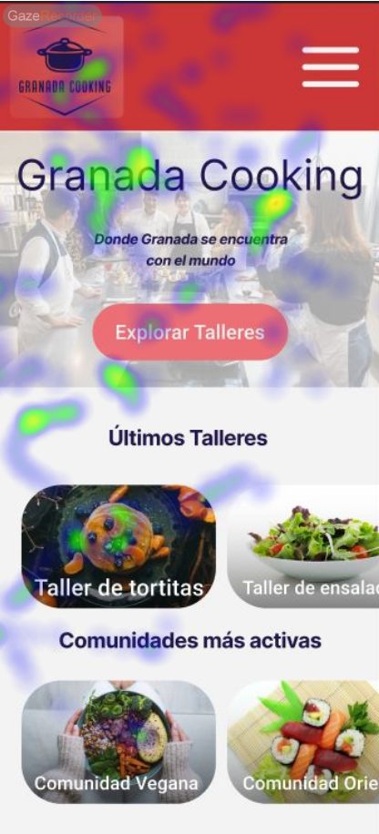
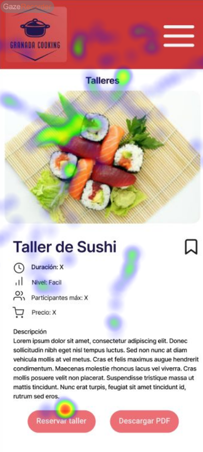
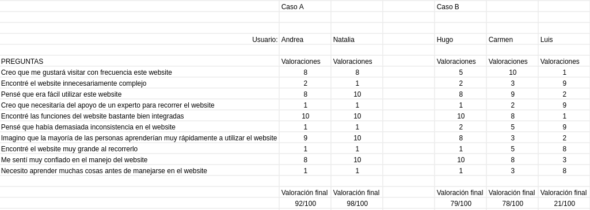

# DIU - Practica 4, entregables

## 1. Introducción
Esta práctica tiene como finalidad evaluar nuestro prototipo con usuarios reales, utilizando distintas técnicas que nos ayuden a explorar la experiencia del usuario y detectar posibles mejoras en el diseño del producto.

Para ello, aplicaremos métodos como el A/B testing, que nos permitirá comparar dos versiones de un producto similar, así como otras herramientas como el cuestionario SUS (System Usability Scale) o el Eye Tracking.

El punto de partida serán dos diseños web: uno será nuestra propia propuesta (versión A) y el otro corresponderá a una práctica de otro compañero, asignada de forma aleatoria (versión B). Seleccionaremos un grupo de personas que actuarán como usuarios de ambas versiones. Después de probar los dos prototipos, deberán completar un cuestionario de usabilidad (escala SUS). Finalmente, analizaremos los datos obtenidos para determinar cuál de las dos opciones resulta más adecuada.

## 2. Asignación del caso B
Se nos ha asignado el grupo **DIU3.McQueen&Sally**. Link del GitHub: https://github.com/McQueen-Sally/UX_CaseStudy

## 3. Reclutamiento de participantes estudio
Para llevar a cabo el A/B Testing, hemos seleccionado a un pequeño grupo de testers que realizarán una serie de pruebas: un formulario con preguntas de interés general sobre su comportamiento en ámbitos que tienen relación con ambos casos, una serie de actividades precedidas de un proceso de eyetracking, y un cuestionario SUS para evaluar la usabilidad del caso que han probado.

A continuación tenemos una tabla con los datos de las personas que han participado en el A/B Testing.
       
|   |   |   |   |   |   |
|---|---|---|---|---|---|
|#id. usuario|Sexo/edad|Ocupación|Experiencia internet|Plataforma|Perfil cubierto|
|1|Mujer 21|Estudiante|[Intermedio]|Movil|[A]|
|2|Hombre 25|Estudiante|[Intermedio]|Windows|[B]|
|3|Hombre 20|Estudiante|[Básico]|Movil|[B]|
|4|Mujer 21|Estudiante|Avanzada|Linux|[A]|

El primer formulario contiene las siguientes preguntas, e incluiremos tras cada una los resultados que hemos recibido tras realizar el test a los distintos usuarios:

En cuales de estas actividades pasas más tiempo a lo largo de la semana?
- Leer libros o ver series
- Hacer deporte
- Ir de compras
- Otras
- Salir a comer por ahí
- Usar las redes sociales

El 60% ha pasado mas tiempo leyendo libros o viendo series, el 20% de compras o usando redes sociales y el restante 20% en otras actividades 

Te gustan más las actividades en grupo o en solitario?
- En Grupo
- En solitario

El 60% prefiere actividades en grupo mientras el 40% en solitario

¿En qué tipo de experiencias o productos prefieres gastar tu dinero?
- Comida
- Tecnología
- Ropa
- Talleres o eventos en grupo
- Viajes

Aqui todas las categorías tienen un mismo nivel de elección menos los talleres o eventos en grupo, que tienen un 0%.

¿Qué valoras más en una experiencia o compra?
- Calidad
- Conveniencia
- Exclusividad
- Precio
- Sostenibilidad

El 80% valora más la calidad y el 20% la sostenibilidad

¿Qué te motiva más a probar una nueva actividad?
- Curiosidad Personal
- Recomendaciones de amigos
- Influencers / Personas Famosas
- Promociones / Descuentos
- Redes sociales

Al 60% le motiva más las recomendaciones de amigos y al 40% su curiosidad personal

## 4. Pruebas diseñadas
### 4.1. Eye tracking
Este estudio de eye tracking se realizó con el objetivo de analizar el comportamiento visual de los usuarios mientras completan dos tareas diferentes en dos casos distintos. En nuestro caso, se les muestra un par de imágenes relacionadas sobre la actividad que van a realizar para monitorizar los puntos en los que más se fijan, para después analizarlo

## Tareas evaluadas

### Caso 1
- Reservar un taller.
- Publicar un post en una comunidad (o, alternativamente, comentar en uno ya existente).

### Caso 2
- Añadir una prenda de ropa al carrito y completar el proceso de compra.
- Vender una prenda de ropa.

Las pruebas se realizaron utilizando la herramienta **Gaze Recorder**

### 4.2. Cuestionario SUS (System Usability Scale Test)
El test sus nos permitirá medir la usabilidad de ambas plataformas. El test SUS se basa en unas 10 preguntas cortas sobre la experiencia del usuario en la página. Estas se pueden valorar desde 1 hasta 10, según el grado de conformidad o acuerdo con la pregunta. De ser negativa, se valorará como nota mas alta el número más bajo y viceversa.

A continuación, se presentan las puntuaciones obtenidas:

#### Conclusiones
## 5. Usability report
El informe de usabilidad del Caso B, "Monedas-Re, prendas para todos" es en general positivo, aunque con algunos puntos negativos a destacar que se han ido revelando a lo largo del A/B Testing. Se ha notado durante la realización de las distintas actividades que la interfaz de la aplicación puede no ser muy intuitiva y llevar a bucles entre menús.

Los resultados del test de usabilidad realizados por un total de 3 personas, muestran entre otros problemas que es bastante común el ignorar por completo el boton de "Tu moda-re" de la página inicial, por no entender que es el botón principal que hay que pulsar para poder registrarse y empezar a navegar.

El Usability Report para el Caso B completo se eneuntra en el archivo [Usability-Report.md](Usability-Report.md).
## 6. Conclusiones

