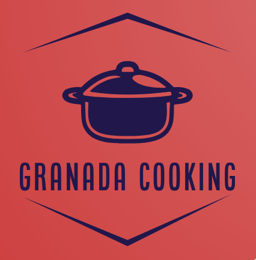
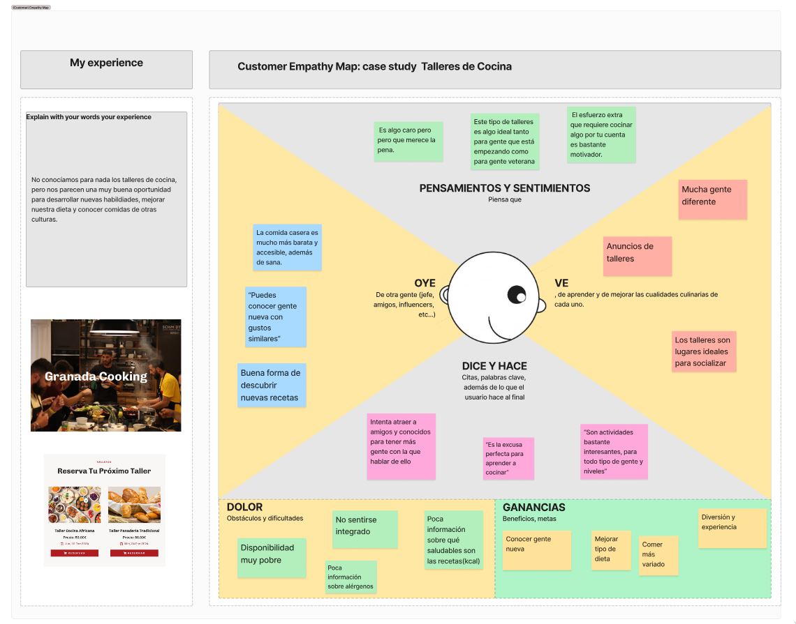
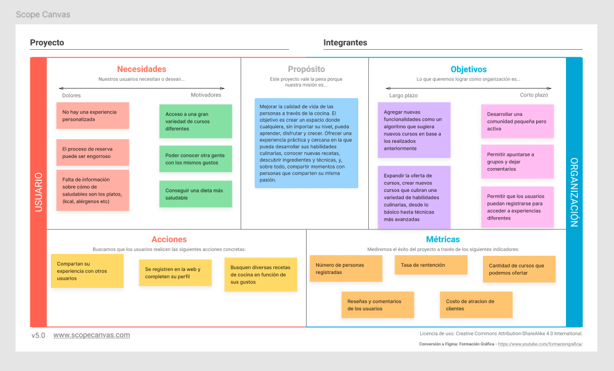
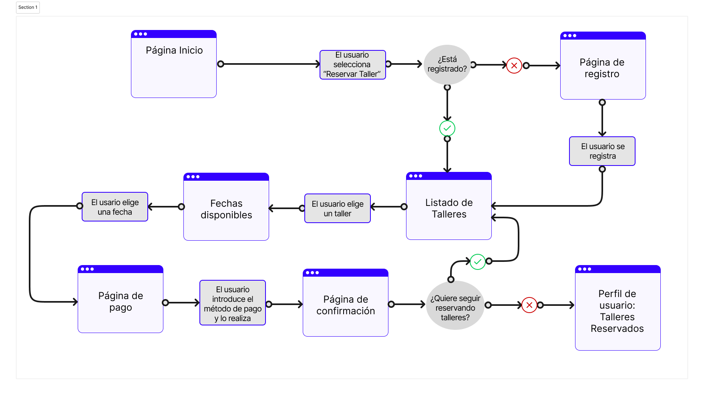
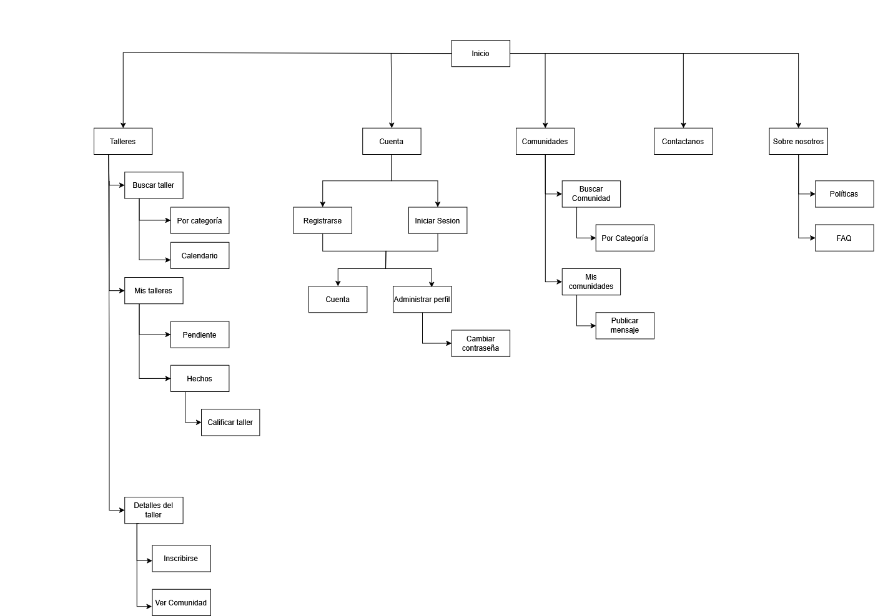
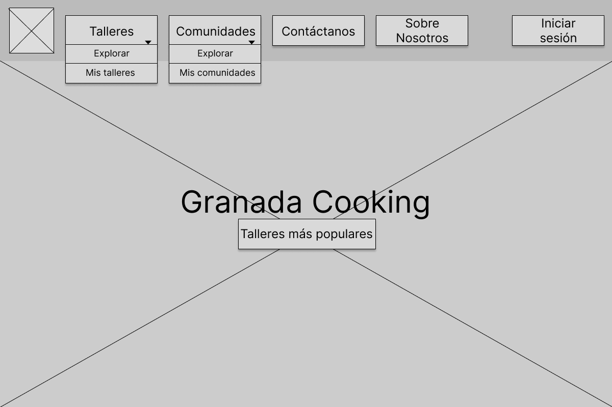
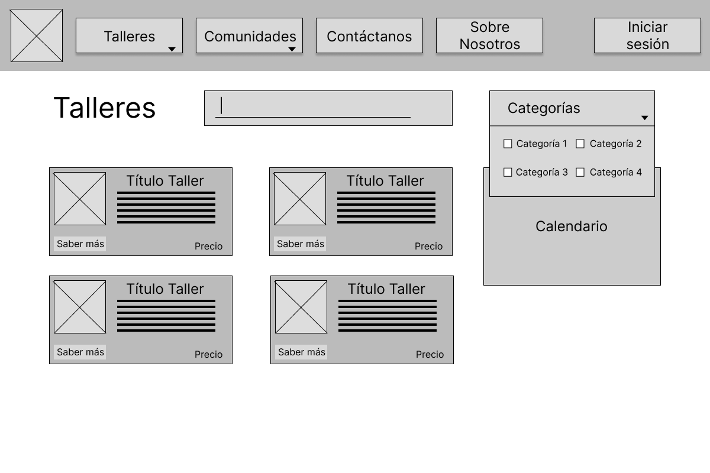
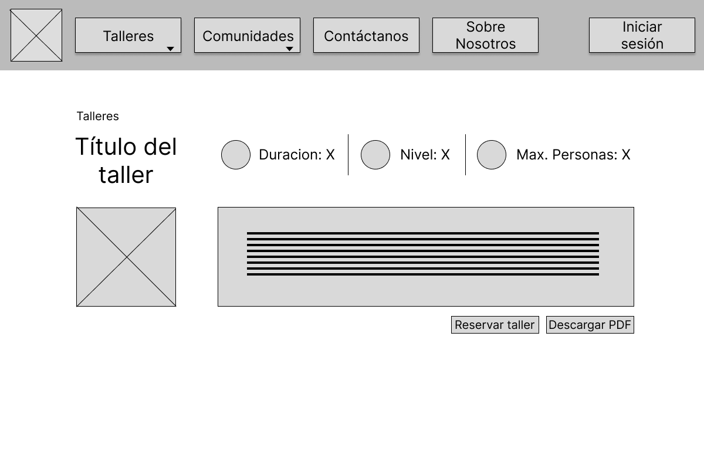
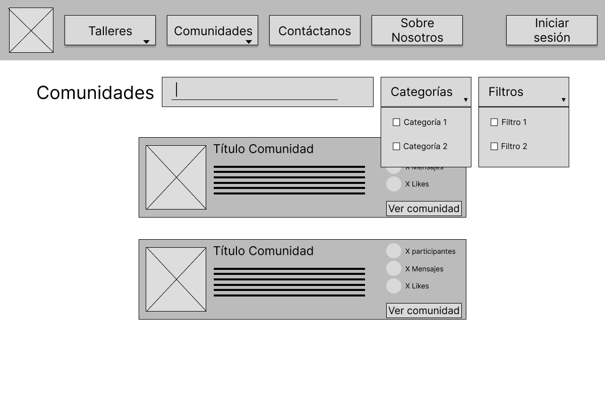
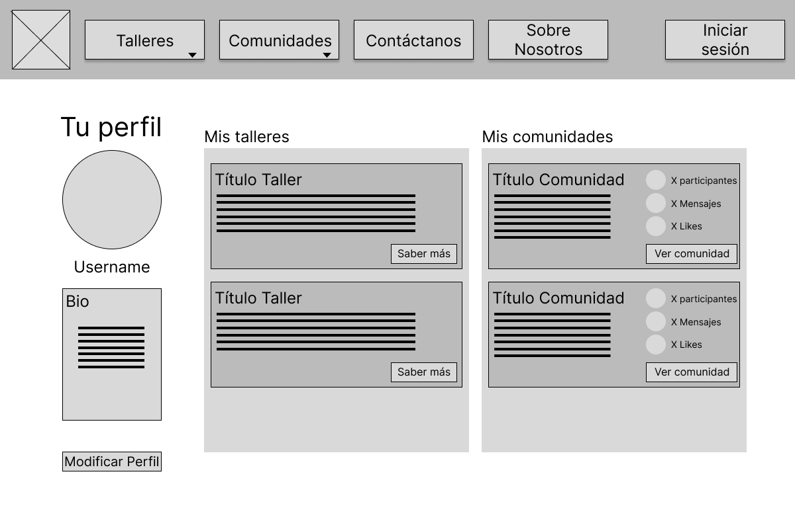

# DIU25
Prácticas Diseño Interfaces de Usuario (Tema: .... ) 

[Guiones de prácticas](GuionesPracticas/)

Grupo: DIU2_Padulink.  Curso: 2024/25 

Actualizado: xx/xx/2025

Proyecto: 

Granada Cooking

Descripción: 

>>> Describa la idea de su producto en la práctica 2 

Logotipo: 

Miembros:
 * :bust_in_silhouette: [ Jose Vera Castillo ](https://github.com/VeraJose05)    :octocat:     
 * :bust_in_silhouette: [ David Pérez Tobarra](https://github.com/ParadoxalGlitch)     :octocat:
----- 

# Proceso de Diseño 

 

## Paso 1. UX User & Desk Research & Analisis 

### 1.a User Reseach Plan
 
-----

### Propósitos y metas
Esta investigación se centrará en adquirir información sobre el tema de la gastronomía/ocio de degustación.

Con esta investigación se busca obtener conocimientos básicos sobre dicho tema, ya que los conocimientos con los que partimos sobre este tema son nulos.

### Participantes de la investigación
Estamos hablando del campo de la Gastronomía por lo que la cantidad de personas que pueden interesarnos y de la que podemos obtener información sobre este tema es bastante extensa e incluye:

* Dueños de comercios relacionados con la gastronomía o expertos en el campo
Estos nos permitirán obtener un conocimiento base sobre el tema y el punto de vista del emprendedor en el campo de la gastronomía.
* Empleados de dichos comercios
Nos ofrecerá una vista similar a la anterior.
* Clientes habituales de dichos comercios
Nos permitirá obtener el punto de vista del usuario sobre el campo, saber qué es lo que el usuario típico quiere y necesita normalmente.
* Potenciales consumidores de estos servicios, como por ejemplo turistas.
Nos permitirá saber cual es el punto de vista de alguien que no ha estado inmerso en el campo pero tiene interés en él.

### Métodos y Procedimientos a usar
* Se realizarán entrevistas a los potenciales participantes listados arriba (ya sean espontáneas o acordadas de antemano). 

* La duración de las entrevistas dependerá del entrevistado, ya que la información que se espera sacar de cada participante será distinta.

* Las preguntas realizadas durante la entrevista incluirán temas como:\
¿Cómo describirías la oferta gastronómica actual en tu negocio o en la región?\
¿Cuáles son las tendencias actuales en gastronomía y degustación que crees que están marcando el mercado?\
¿Qué preguntas o comentarios hacen con más frecuencia los clientes sobre la comida o las bebidas?\
¿Cuáles son tus expectativas cuando visitas un lugar gastronómico nuevo?\

### 1.b Competitive Analysis
 
-----

Hemos seleccionado tres aplicaciones para realizar el Competitie Analysis:

* **Granada Cooking Experience**: ofrece talleres de cocina diseñados para que los participantes desarrollen sus habilidades culinarias y disfruten de experiencias gastronómicas únicas.

* **Pilsaeduca**: ofrece talleres y cursos de cocina prácticos dirigidos a todos los niveles, desde principiantes hasta profesionales. Destaca por su enfoque en la formación práctica y personalizada, adaptándose a las necesidades de cada participante y ofreciendo experiencias gastronómicas enriquecedoras.

* **Aptitü**: se especializa en la organización de eventos gastronómicos y en la formación culinaria. Ofrece una amplia variedad de talleres y cursos de cocina dirigidos tanto a particulares como a empresas

[Competitive_Analysis PDF](P1/Competitor_Analysis.pdf)

### 1.c Personas
 
-----

Por un lado tenemos a Alfredo Martínez es un joven relacionado con la tecnología que quiere descubrir nuevas recetas sanas\
Por otro tenemos a Ángeles Chavez, una ama de casa y dependienta de una verdulería que quiere indagar mucho más en el mundo gastronómico\

### 1.d User Journey Map
 
----
La primera experiencia, de Alfredo, busca representar una persona sin conocimientos en el campo, que solo busca probar por primera vez lo que son los talleres y catas gastronómicas. Estas experiencias suele ser vital representarlas ya que\
es importante saber tratar con aquellos clientes que nunca han tenido contacto con el tema a tratar, en este caso el ocio de degustación.
La segunda experiencia, de Ángeles Chavez viene de querer representar una persona con conocimientos medios en el campo pero que nunca ha realizado ningún taller de gastronomía, pero tiene interés en ello. Estas experiencias tambien suelen ser habituales ya que uno de los grupos principales de dichos talleres suelen ser personas con nivel medio cuya experiencia es la primera y suelen tener muchisimas dudas, miedos, nervios, ansiedad, etc...

### 1.e Usability Review
 
----

Como revisión de la usabilidad evaluamos diferentes funcionalidades de la web de Granda Cooking y analizamos cuáles son adecuadas y cuales podrían mejorarse.

Los puntos fuertes son la navegación, el uso de imagenes para hacer todo más facil de reconocer y la funcionalidad general de la página, pero sufre mucho en el apartado de la búsqueda de elementos, donde todo depende de un único motor de búsqueda sin filtros, y de la falta de texto adicional o ayuda para comprender que es posible hacer en cada parte de la página.

La puntuación general es de 75, indica que los usuarios pueden usar la mayoría de funcionalidades sin problema pero la experiencia aún se puede mejorar

[Usability Review PDF](P1/Usability-review.pdf)

### 1.f BRIEFING
----

Actualmente, un usuario promedio puede navegar por la página y completar las tareas principales, pero la experiencia sigue siendo deficiente en varios aspectos clave. Uno de los problemas más críticos es el funcionamiento del calendario a la hora de realizar reservas. Su diseño no es intuitivo, presenta fallos en la selección de fechas y, en ocasiones, no carga correctamente, lo que genera confusión y frustración en los usuarios. Además, la visibilidad de la fecha y la hora es insuficiente, lo que dificulta que los usuarios verifiquen y confirmen su selección con facilidad.

Otro aspecto que requiere una mejora urgente es la funcionalidad de búsqueda. Actualmente, el sistema no permite realizar búsquedas con errores tipográficos o términos similares, lo que obliga al usuario a ingresar las palabras exactas para obtener resultados relevantes. Esto hace que la búsqueda sea poco útil y poco flexible, afectando negativamente la experiencia de navegación

 

## Paso 2. UX Design  

### 2.a Reframing / IDEACION: Feedback Capture Grid / EMpathy map 
 
----
A continuación, se presenta el mapa de empatía elaborado a partir de las experiencias y necesidades identificadas en la práctica anterior, con el objetivo de comprender mejor al usuario y guiar el diseño centrado en sus emociones, pensamientos y comportamientos.

### 2.b ScopeCanvas

----

Este Scope Canvas recoge nuestra propuesta de valor, definiendo claramente el problema que queremos resolver, los objetivos del proyecto, las necesidades del usuario y las soluciones planteadas. Con ello, buscamos alinear el diseño y desarrollo del servicio con una visión estratégica centrada en ofrecer una experiencia útil, sostenible y diferenciadora

### 2.b User Flow (task) analysis 
 
-----

Este diagrama muestra el recorrido que realiza el usuario dentro de nuestra propuesta digital, desde el acceso inicial hasta la consecución de sus objetivos principales. Nos permite identificar los pasos clave, optimizar la experiencia de navegación y garantizar que cada interacción esté alineada con las necesidades y expectativas del usuario.

### 2.c IA: Sitemap + Labelling 
 
----

Este sitemap representa la arquitectura de información propuesta para nuestro proyecto. Su objetivo es organizar de forma lógica y jerárquica los contenidos y secciones de la interfaz, facilitando la navegación del usuario y asegurando una experiencia clara, intuitiva y coherente desde el inicio.

* [Labelling](P2/Labelling.pdf)

### 2.d Wireframes
 
-----

En el menú principal se debería mostrar algún curso destacado del mes, con la opción directa de poder reservarlo.
Añadir además una desccripción sobre qué son las comunidades y qué ventajas aportan al usuario.

 

## Paso 3. Mi UX-Case Study (diseño)

### 3.a Moodboard

-----

Se ha realizado un Moodboard para establecer los estilos de nuesta aplicación. La paleta busca reflejar un ambiente amigable, para todo el público usando colores no tan saturados, y más pastel. Como tipografías hemos elegido Calc Sans como principal y Quicksand como secundaria buscando un estilo que sea agradable y destacable al mismo tiempo para la principal y simple para la secundaria. El eslogan destaca que no solo ofrecemos una experiencia culinaria en Granada si no que proviene de todas las partes del mundo.

El logo se ha desarrollado con la herramienta Looka

### 3.b Landing Page
 
----

El landing page representa el primer punto de contacto entre el usuario y nuestra aplicación, por lo que su diseño juega un papel fundamental en la captación de usuarios. Su objetivo principal es presentar de forma clara, atractiva y convincente el valor que ofrece la plataforma.

### 3.c Guidelines
 
----

### 1. Navegación & Estructura
- **Navbar** Permite una navegación clara y accesible
- **Hero Image + Carrusel**  Imagen destacada de un taller + carrusel con talleres recomendados, categorías o chefs.
- **Search (Búsqueda)**  Barra de búsqueda fija para filtrar talleres por nombre, tipo, ingredientes, etc.
- **Article List 5-7 Cards Items** -> COMPLETAR

### 2. Flujo de Usuario

- **Wizards (Flujo de Registro)**  Durante el proceso de registro, los usuarios son guiados.
- **Item Details + Actions (Detalles de Receta o Taller)**  En la vista de detalle, los usuarios pueden consultar información específica sobre un taller o comunidad y realizar acciones como **unirse**, **descargar PDF** o **reservar**.

- **Reserva de Talleres**   Proceso simplificado para seleccionar un taller y confirmar asistencia. Permite realizar reservas en pocos pasos.

- **Calendario de Eventos** Herramienta visual para explorar la disponibilidad de los talleres. Los usuarios pueden elegir una franja de tiempo y ver qué talleres hay disponibles.

- **Comunidades de Usuarios** Secciones dedicadas a distintas temáticas (por ejemplo, repostería, cocina vegana, principiantes). Los usuarios pueden unirse a comunidades para recibir sugerencias personalizadas o participar en eventos temáticos.

### 3. Comunicación y Retroalimentación

- **Form Input (Formulario de Contacto o Registro)**  Formularios intuitivos para facilitar el registro e inscripción a talleres/comunidades. Se evitan formularios extensos y se prioriza la experiencia de usuario.

- **About (Acerca de Nosotros)**  Página informativa sobre el equipo, misión y visión de la plataforma. Refuerza la **confianza y transparencia**, mostrando el valor humano detrás de los talleres ofrecidos.

### 3.d Mockup
 
----
En este [link](https://www.figma.com/design/4K1tR8tdYivjwLtCuL0Ex5/Layout-HI-FI?node-id=0-1&p=f&t=1mXaAcP23nyf6x6Z-0) se puede ver el Prototype en acción.

### 3.e ¿My UX-Case Study?
 
-----

En el Case Study se presenta una visión detallada del desarrollo y diseño de nuestra aplicación, explicada de forma accesible para que cualquier persona, incluso sin conocimientos técnicos, pueda comprender el proceso y los objetivos del proyecto.

A continuación, puede visualizar el [Case Study](../README.md) que hemos llevado a cabo.

 

## Paso 4. Pruebas de Evaluación 

### 4.a Reclutamiento de usuarios 

-----

>>> Breve descripción del caso asignado (llamado Caso-B) con enlace al repositorio Github
>>> Tabla y asignación de personas ficticias (o reales) a las pruebas. Exprese las ideas de posibles situaciones conflictivas de esa persona en las propuestas evaluadas. Mínimo 4 usuarios: asigne 2 al Caso A y 2 al caso B.

| Usuarios | Sexo/Edad     | Ocupación   |  Exp.TIC    | Personalidad | Plataforma | Caso
| ------------- | -------- | ----------- | ----------- | -----------  | ---------- | ----
| User1's name  | H / 18   | Estudiante  | Media       | Introvertido | Web.       | A 
| User2's name  | H / 18   | Estudiante  | Media       | Timido       | Web        | A 
| User3's name  | M / 35   | Abogado     | Baja        | Emocional    | móvil      | B 
| User4's name  | H / 18   | Estudiante  | Media       | Racional     | Web        | B 

### 4.b Diseño de las pruebas 
 
-----

>>> Planifique qué pruebas se van a desarrollar. ¿En qué consisten? ¿Se hará uso del checklist de la P1?

### 4.c Cuestionario SUS
 
----

>>> Como uno de los test para la prueba A/B testing, usaremos el **Cuestionario SUS** que permite valorar la satisfacción de cada usuario con el diseño utilizado (casos A o B). Para calcular la valoración numérica y la etiqueta linguistica resultante usamos la [hoja de cálculo](https://github.com/mgea/DIU19/blob/master/Cuestionario%20SUS%20DIU.xlsx). Previamente conozca en qué consiste la escala SUS y cómo se interpretan sus resultados
http://usabilitygeek.com/how-to-use-the-system-usability-scale-sus-to-evaluate-the-usability-of-your-website/)
Para más información, consultar aquí sobre la [metodología SUS](https://cui.unige.ch/isi/icle-wiki/_media/ipm:test-suschapt.pdf)
>>> Adjuntar en la carpeta P4/ el excel resultante y describa aquí la valoración personal de los resultados 

### 4.d A/B Testing
 
-----

>>> Los resultados de un A/B testing con 3 pruebas y 2 casos o alternativas daría como resultado una tabla de 3 filas y 2 columnas, además de un resultado agregado global. Especifique con claridad el resultado: qué caso es más usable, A o B?

### 4.e Aplicación del método Eye Tracking 

----

>>> Indica cómo se diseña el experimento y se reclutan los usuarios. Explica la herramienta / uso de gazerecorder.com u otra similar. Aplíquese únicamente al caso B.

  
>>> Cambiar esta img por una de vuestro experimento. El recurso deberá estar subido a la carpeta P4/  

>>> gazerecorder en versión de pruebas puede estar limitada a 3 usuarios para generar mapa de calor (crédito > 0 para que funcione) 

### 4.f Usability Report de B
 
-----

>>> Añadir report de usabilidad para práctica B (la de los compañeros) aportando resultados y valoración de cada debilidad de usabilidad. 
>>> Enlazar aqui con el archivo subido a P4/ que indica qué equipo evalua a qué otro equipo.

>>> Complementad el Case Study en su Paso 4 con una Valoración personal del equipo sobre esta tarea

 

## Paso 5. Exportación y Documentación 

### 5.a Exportación a HTML/React
 
----

>>> Breve descripción de esta tarea. Las evidencias de este paso quedan subidas a P5/

### 5.b Documentación con Storybook

----

>>> Breve descripción de esta tarea. Las evidencias de este paso quedan subidas a P5/

 

## Conclusiones finales & Valoración de las prácticas

>>> Opinión FINAL del proceso de desarrollo de diseño siguiendo metodología UX y valoración (positiva /negativa) de los resultados obtenidos. ¿Qué se puede mejorar? Recuerda que este tipo de texto se debe eliminar del template que se os proporciona 

